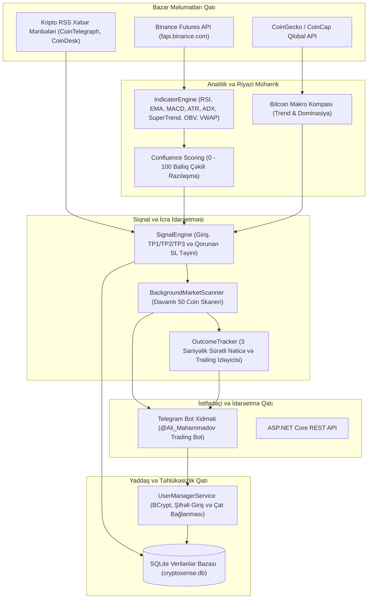

# CryptoSense Algoritmik Ticarət Sistemi: Riyazi Spesifikasiya və Arxitektura Hesabatı

Bu sənəd **CryptoSense v2** ticarət robotunun arxa fonunda (backend) icra olunan bütün riyazi modelləri, texniki analiz indikatorlarının düsturlarını, makro bazar qiymətləndirməsini, siqnal generasiya məntiqini və risk idarəetmə qaydalarını tam təfərrüatı ilə əks etdirir.

---

## 1. Sistemin Ümumi Arxitektura Sxemi

Sistem yüksək etibarlı **Clean Architecture** və mikro-servisə bənzər arxa plan işçi (worker) mexanizmləri üzərində qurulmuşdur:

---

## 2. Kriptovalyuta Necə Analiz Edilir? (İndikatorlar və Düsturlar)

Sistem hər bir zaman kəsiyində (1m, 3m, 5m, 15m, 1h, 4h) son 50–100 ədəd bağlanmış şam (Kline) məlumatlarını toplayır və aşağıdakı riyazi indikatorları hesablayır:

### A. RSI (Relative Strength Index - 14 dövr)
Bazarın impulsunu və aşırı alış/satış zonalarını ölçür.
- **Riyazi Düstur:**
  $$\text{RSI} = 100 - \left( \frac{100}{1 + RS} \right)$$
  $$RS = \frac{\text{Wilder's Smoothing (Orta Qazanc)}}{\text{Wilder's Smoothing (Orta İtki)}}$$
- **Sistemdəki Şərtlər:**
  - $RSI > 55$: Bullish (+1 səs)
  - $RSI < 45$: Bearish (-1 səs)
  - $45 \le RSI \le 55$: Neytral (0 səs)

### B. EMA (Eksponensial Hərəkətli Orta - EMA20, EMA50, EMA200)
Son qiymətlərə daha böyük çəki verən dinamik trend xətti.
- **Riyazi Düstur:**
  $$\text{EMA}_t = \text{Qiymət}_t \times \alpha + \text{EMA}_{t-1} \times (1 - \alpha), \quad \alpha = \frac{2}{N + 1}$$
- **Sistemdəki Şərtlər:**
  - $EMA_{20} > EMA_{50}$ və $\text{Qiymət} > EMA_{20}$: Güclü Yüksəliş (+1 səs)
  - $EMA_{20} < EMA_{50}$ və $\text{Qiymət} < EMA_{20}$: Güclü Eniş (-1 səs)

### C. MACD (Moving Average Convergence Divergence - 12, 26, 9)
- **Riyazi Düstur:**
  $$\text{MACD Xətti} = \text{EMA}_{12}(\text{Bağlanış}) - \text{EMA}_{26}(\text{Bağlanış})$$
  $$\text{Siqnal Xətti} = \text{EMA}_9(\text{MACD Xətti})$$
  $$\text{Histoqram} = \text{MACD Xətti} - \text{Siqnal Xətti}$$
- **Sistemdəki Şərtlər:**
  - $\text{Histoqram} > 0$ və artır: Güclü Alış (+1 səs)
  - $\text{Histoqram} < 0$ və azalır: Güclü Satış (-1 səs)

### D. ATR (Average True Range - 14 dövr)
Bazarın həqiqi volatillik (dalğalanma) dəhlizini hesablayır.
- **Riyazi Düstur:**
  $$\text{TR} = \max\Big( (\text{High}_t - \text{Low}_t), |\text{High}_t - \text{Close}_{t-1}|, |\text{Low}_t - \text{Close}_{t-1}| \Big)$$
  $$\text{ATR}_t = \frac{\text{ATR}_{t-1} \times 13 + \text{TR}_t}{14}$$
- **Tətbiqi:** Stop-Loss və hədəf məsafələrinin minimum təhlükəsiz buferini təyin edir.

### E. ADX (Average Directional Index - 14 dövr)
Trendin olub-olmamasını və gücünü ölçür (Saxta siqnalları süzgəcdən keçirir).
- **Riyazi Düstur:**
  $$\text{DX} = \left( \frac{|+\text{DI} - -\text{DI}|}{+\text{DI} + -\text{DI}} \right) \times 100, \quad \text{ADX} = \text{SMA}_{14}(\text{DX})$$
- **Sistemdəki Şərtlər:**
  - $ADX \ge 25$: Bazar güclü trenddədir (İndikatorların çəkisi 1.25x artırılır).
  - $ADX < 20$: Bazar ölü/yan hərəkətdədir (Siqnallar bloklanır və ya çəkisi 0.75x azaldılır).

### F. SuperTrend (Dövr: 10, Çoxaldıcı: 3.0)
ATR əsaslı dinamik dəstək və müqavimət xətti.
- **Üst Zolaq:** $\frac{\text{High} + \text{Low}}{2} + 3.0 \times \text{ATR}$
- **Alt Zolaq:** $\frac{\text{High} + \text{Low}}{2} - 3.0 \times \text{ATR}$
- **Tətbiqi:** Trendin istiqamətini dəqiq təsdiqləyir.

### G. Bollinger Qrupları (Bollinger Bands - 20, 2)
Volatilliyin sıxılmasını və partlayışını ölçür.
- **Orta:** $\text{SMA}_{20}(\text{Close})$
- **Üst/Alt:** $\text{SMA}_{20} \pm 2 \times \sigma$
- **Bandwidth:** $\frac{\text{Üst} - \text{Alt}}{\text{Orta}}$

### H. OBV (On-Balance Volume) & VWAP (Həcmlə Çəkilmiş Orta Qiymət)
Böyük institutların və balinaların alqı-satqı axınını aşkar edir:
$$\text{VWAP} = \frac{\sum (\text{Tipik Qiymət} \times \text{Həcm})}{\sum \text{Həcm}}$$

---

## 3. Confluence Razılaşma Balı (3 Ortogonal Ox Modeli)

Eyni təbiətli indikatorların süni şəkildə toplanması (multikollinearlıq) xətasının qarşısını almaq üçün sistem **3 Müstəqil Ortogonal Ox** riyazi modelinə əsaslanır:

### A. Ox 1: İstiqamət Meyilliliyi (Directional Alignment)
- **Komponentlər:** $EMA_{20}/EMA_{50}$ oriyentasiyası, $SMA_{20}/SMA_{50}$ və SuperTrend vəziyyəti.
- **Riyazi Vektor:** $\text{Direction} = (EMA \times 0.40) + (SMA \times 0.25) + (SuperTrend \times 0.35) \in [-1.0, +1.0]$.

### B. Ox 2: Bazar Rejimi və Sönümləmə (Market Regime & Volatility Damping)
- **Komponentlər:** Wilder ADX və Bollinger Bandwidth.
- **Məqsəd:** İstiqamət nə qədər aydın olsa belə, əgər bazar enerjisiz yan hərəkətdədirsə ($ADX < 20$), trend siqnalları mənfi riyazi gözləntiyə malik olur.
- **Tənzimləyici Əmsal:**
  $$\text{Regime Multiplier} = \begin{cases} 1.00, & \text{əgər } ADX \ge 25 \text{ (Güclü Trend Rejimi)} \\ 0.85, & \text{əgər } 20 \le ADX < 25 \text{ (Orta Keçid Rejimi)} \\ 0.50, & \text{əgər } ADX < 20 \text{ (Səs-küylü Yan Bazar Sönümləməsi)} \end{cases}$$
- $\text{Trend Balı} = \text{Direction} \times \text{Regime Multiplier}$.

### C. Ox 3: İştirak və Likvidlik Təsdiqi (Participation & Liquidity)
- **Komponentlər:** Həcm Sıçrayış Əmsalı ($\text{Volume Surge}$), $VWAP$ oriyentasiyası və $OBV$ tendensiyası.
- **Məqsəd:** Qiymət hərəkətinin arxasında institusional həcmin və alqı-satqı axınının olub-olmadığını təsdiqləyir. Əgər həcm sıçrayışı $\ge 1.30x$-dirsə, siqnal gücləndirilir; həcm zəifdirsə, çəkisi azaldılır.

### D. Yekun Razılaşma Balı və 1m Qoruyucu Süzgəci:
$$\text{RawScore} = (\text{Trend} \times 0.40) + (\text{Momentum} \times 0.30) + (\text{Participation} \times 0.20) + (\text{Volatility} \times 0.10)$$
$$\text{ConfluenceScore} = \text{Clamp}\Big(\frac{\text{RawScore} \times \text{MtfFactor} + 1.0}{2.0} \times 100, \; 5\%, \; 98\%\Big)$$

- **1m Ultra-Qısa Timeframe Qoruması:** 1m timeframelərdə komissiya və mikro səs-küyün kapitalı əritməsinin qarşısını almaq üçün $ADX \ge 25$ və $\text{Volume Surge} \ge 1.35x$ sərt tələbi qoyulur; əks halda mövqe açılmır və peşəkar neytral rejim saxlanılır.

---

## 4. Bitcoin və Bazar Dominasiyası Necə Qiymətləndirilir?

### A. Bitcoin Kompası (BTC Compass)
Bitcoin bütün kriptovalyuta bazarının aparıcı lokomividir. Sistem Bitcoin-in 15m, 1h və 24h göstəricilərini canlı analiz edərək 0-100% arası **Bullish Score** çıxarır:
- **Trend Təyini:**
  - $Score \ge 60\%$: **YÜKSƏLİŞ (BULLISH) 🟢**
  - $Score \le 40\%$: **ENİŞ (BEARISH) 🔴**
  - $40\% < Score < 60\%$: **NEYTRAL (YAN HƏRƏKƏT) ⚪**

### B. Qlobal Bazar Dominasiyası (BTC.D və USDT.D)
Sistem CoinGecko və CoinCap qlobal API-ləri vasitəsilə 3 dəqiqədən bir qlobal bazar kapitallaşmasını çəkir:
- **Bitcoin Dominantlığı ($BTC.D$):** $\frac{\text{Bitcoin Bazar Dəyəri}}{\text{Ümumi Kripto Bazar Dəyəri}} \times 100$
- **Tether Dominantlığı ($USDT.D$):** $\frac{\text{USDT Bazar Dəyəri}}{\text{Ümumi Kripto Bazar Dəyəri}} \times 100$

**Riyazi Tətbiq Qaydası:**
- Əgər $BTC.D \ge 58.0\%$ olarsa: Kapital altcoinlərdən çıxaraq Bitcoin-ə axır. Bu zaman **Altcoin LONG siqnalları məhdudlaşdırılır** və ya əlavə təsdiq tələb olunur.
- Əgər $USDT.D$ artırsa: Bazar iştirakçıları nağd pula keçir (ümumi bazar enişi).

### C. Daxil Olduğu Coinin Dominantlığı Dəyərləndirilirmi?
**Dəqiq və Dürüst İzah:**
Kripto terminologiyasında fərdi altcoinlər (məsələn: SUI, GALA, PEPE) üçün qlobal bazarda "dominantlıq" faizi adətən 0.1% - 0.5%-dən kiçik olduğu üçün standart iqtisadi dominantlıq adlandırılmır. 
Buna görə də sistem altcoinlər üçün saxta bir "dominantlıq" rəqəmi uydurmur, onun əvəzinə həmin coinin **"Daxili Həcm və Likvidlik Payı"nı (Volume Surge Ratio)** hesablayır:
$$\text{Volume Surge} = \frac{\text{Cari Şamın Həcmi}}{\text{Son 20 Şamın Orta Həcmi}}$$
Əgər bu nisbət $1.5x$ - $2.0x$-dən böyükdürsə, həmin coinə böyük həcmin daxil olduğu təsdiqlənir.

---

## 5. LONG və SHORT Əməliyyatlarının Təyin Olunma Düsturları

Sistem siqnalları 3 peşəkar kateqoriya üzrə təsnif edir:

### 1. Peşəkar Retest (Trend İçi Geri Çəkilmə):
- **LONG Şərtləri:**
  - $EMA_{20} > EMA_{50}$ (Yüksəliş trendi)
  - Qiymət $EMA_{20}$ zonasına geri çəkilib ($|\text{Qiymət} - EMA_{20}| / \text{Qiymət} \le 0.85\%$) və ya şamın alt kölgəsi alış təzyiqi göstərir ($\text{Alt Fitil} / \text{Şam Hündürlüyü} \ge 35\%$).
  - $38 \le RSI \le 68$ (Aşırı alınmayıb)
  - Bitcoin Kompası $\ge 45\%$
- **SHORT Şərtləri:**
  - $EMA_{20} < EMA_{50}$ (Eniş trendi)
  - Qiymət $EMA_{20}$ zonasına qalxıb və ya şamın üst kölgəsi satış təzyiqi göstərir ($\text{Üst Fitil} / \text{Şam Hündürlüyü} \ge 35\%$).
  - $32 \le RSI \le 62$
  - Bitcoin Kompası $\le 55\%$

### 2. Peşəkar Breakout / Breakdown (Səviyyə Qırılması):
- **Breakout LONG:** Qiymət lokal müqaviməti qırıb + SuperTrend Bullish + MACD Hist > 0 + Bitcoin Kompası Bullish.
- **Breakdown SHORT:** Qiymət lokal dəstəyi qırıb + SuperTrend Bearish + MACD Hist < 0 + Bitcoin Kompası Bearish.

### 3. Peşəkar Trend:
- Confluence Balı $\ge 72\%$ (LONG) və ya $\le 28\%$ (SHORT).

---

## 6. Stop-Loss və Hədəflərin (TP1, TP2, TP3) Təyin Olunma Düsturları

Kripto fyuçers bazarında mikro-dalğalanmaların (spread və bazar səs-küyü) əməliyyatı vaxtından əvvəl bağlamaması üçün qorunan ATR buferi tətbiq olunur:

### A. Minimum Təbii Bufer ($\text{minTfMultiplier}$):
- **1m:** $1.2\%$ ($0.012$)
- **3m:** $1.5\%$ ($0.015$)
- **5m:** $1.8\%$ ($0.018$)
- **15m:** $2.4\%$ ($0.024$)
- **1h:** $3.5\%$ ($0.035$)
- **4h:** $5.0\%$ ($0.050$)

### B. Hesablanan Risk ($R$):
$$R = \max\Big(1.5 \times \text{ATR}, \; \text{Giriş Qiyməti} \times \text{minTfMultiplier}\Big)$$

### C. Stop-Loss (SL) Təyini:
- **LONG üçün:**
  $$\text{SL} = \text{Giriş Qiyməti} - R$$
  *(Əgər yaxınlıqda lokal struktur dəstəyi varsa, SL dəstəyin dərhal altına yerləşdirilir: $Support \times 0.9985$)*
- **SHORT üçün:**
  $$\text{SL} = \text{Giriş Qiyməti} + R$$
  *(Əgər yaxınlıqda lokal struktur müqaviməti varsa: $Resistance \times 1.0015$)*

### D. Take-Profit (TP) Səviyyələri:
Riyazi risk/mükafat (Risk/Reward) nisbətləri:
- **Hədəf 1 (TP1):** $\text{Giriş} \pm (R \times 1.15)$
- **Hədəf 2 (TP2):** $\text{Giriş} \pm (R \times 1.85)$ *(və ya növbəti struktur səviyyəsi)*
- **Hədəf 3 (TP3):** $\text{Giriş} \pm (R \times 2.80)$

---

## 7. Mərhələli Risk İdarəetməsi və Nəticə Bildirişləri

Açıq əməliyyat hər 3 saniyədən bir canlı kotirovkalarla yoxlanılır:

1. **TP1 Vurulduqda:**
   - Əməliyyat dərhal **Uğurlu (TP1) ✅** elan edilir.
   - Stop-Loss səviyyəsi avtomatik olaraq **Giriş Qiymətinə (Breakeven) + Spread/Komissiya Buferinə** çəkilir (LONG üçün $\text{Giriş} \times 1.0005$, SHORT üçün $\text{Giriş} \times 0.9995$). Bu, bid-ask spreadi və birja komissiyası səbəbilə mövqenin vaxtından əvvəl zərərlə kəsilməsinin qarşısını tamamilə alır.
2. **TP2 Vurulduqda:**
   - Stop-Loss səviyyəsi **TP1** qiymətinə qaldırılır (əldə olunmuş mənfəət zəmanət altına alınır).
3. **TP3 Vurulduqda:**
   - Əməliyyat tam mənfəətlə bağlanır.
4. **SL Vurulduqda:**
   - İlkin mərhələdə qiymət SL-ə dəyərsə, dərhal təcili **Stop Loss ❌** bildirişi göndərilir.
5. **Dinamik Şam Müddəti Bitdikdə (Trade Expiry):**
   - **1m:** 12 dəqiqə (~12 şam)
   - **3m:** 21 dəqiqə (~7 şam)
   - **5m:** 35 dəqiqə (~7 şam)
   - **15m:** 90 dəqiqə (~6 şam)
   - *Qayda:* Əgər vaxt bitənə qədər TP1 vurulubsa $\rightarrow$ Qorunmuş Qazancla Uğurlu bağlanır ✅. Əgər TP1 vurulmayıbsa $\rightarrow$ Hədəfə Çatmadı (Uğursuz) bağlanır ❌.
6. **Soyuma Müddəti (Cooldown):**
   - Əməliyyat bağlandıqdan sonra eyni coin üzrə 5-30 dəqiqə ərzində təkrar əməliyyat açılması bloklanır.

---

## 8. Qarşı Tərəf / Mütəxəssislə Müzakirə Üçün Peşəkar Suallar

Bu hesabatı təqdim etdiyiniz mütəxəssis, tərəfdaş və ya investorla müzakirə aparmaq üçün hazırlanmış strateji suallar:

1. **Risk/Mükafat (R:R) Nisbəti:**
   - *Hal-hazırda sistem TP1 üçün 1.15x, TP2 üçün 1.85x, TP3 üçün 2.80x risk məsafəsindən istifadə edir. Sizin ticarət strategiyanıza görə, scalping (1m/3m) və intraday (15m) rejimlərində bu əmsalları daha da optimallaşdırmaq üçün hansı nisbətləri tövsiyə edərdiniz?*
2. **Likvidlik və Əmr Kitabı (Order Book Depth):**
   - *Sistemə Binance Futures L2 Order Book (Bid/Ask divarları və alış-satış sıxlığı) analizini əlavə etsək, saxta qırılmaları (fake breakout) aradan qaldırmaqda nə dərəcədə effektiv olar?*
3. **Volatillik Adaptasiyası (Dynamic Multipliers):**
   - *Yüksək beta və memecoin-lərdə (PEPE, DOGE, SHIB) ATR əmsalının 1.5x-dən 2.0x-ə qaldırılması, lakin BTC və ETH kimi iri kapitallı coinlərdə 1.3x saxlanılması barədə fikriniz nədir?*
4. **Çoxzamanlı Təsdiq (Multi-Timeframe Confluence):**
   - *Məsələn, 3m zaman kəsiyində verilən siqnalın mütləq şəkildə 15m Trend və SuperTrend istiqaməti ilə eyni olmasını sərt qayda kimi tətbiq etsək, siqnal tezliyi ilə win-rate arasındakı balansı necə qiymətləndirirsiniz?*
5. **Fundinq Dərəcəsi (Funding Rate) və Açıq Mövqelər (Open Interest):**
   - *Sistemə Binance Funding Rate və Open Interest (OI) indikatorunun əlavə olunmasını institusional mövqeləri qabaqlamaq baxımından məqsədəuyğun hesab edirsinizmi?*
