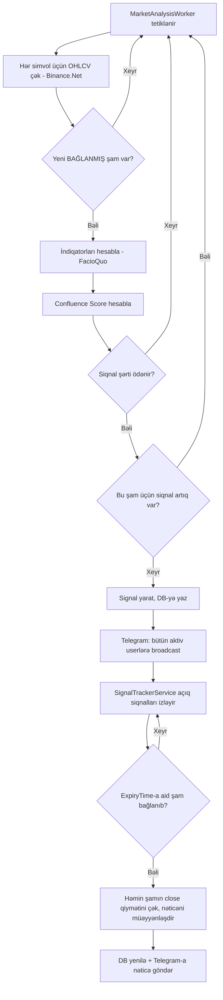

# Kripto Futures Siqnal Botu — Tam Sistem Spesifikasiyası (v2)

> Bu sənəd birbaşa AI kodlaşdırma alətinə (Claude Code, ChatGPT və s.) tapşırıq kimi verilə bilər. Bölmə 11-də hazır "tapşırıq" mətni var.
>
> **v2 qeydi:** Bu versiya orijinal spesifikasiyanı saxlayır, amma real dünyada mütləq qarşılaşılacaq **struktur qüsurları və edge case-ləri** aydın işarələyir (bax 🔴 və ⚠️ bloklar). Kodu yazan agent bu blokları görməzdən gəlməməlidir — onlar layihənin ilk canlı testində dərhal problem verəcək yerlərdir.

**Əsas fərziyyələr (lazım gələrsə dəyişin):**
- İzlənən cütlər: BTCUSDT, ETHUSDT (siyahı asanlıqla genişlənə bilər, konfiqurasiyadan oxunsun — hardcoded olmasın)
- Verilənlər bazası: PostgreSQL (tövsiyə — pulsuz, EF Core ilə əla işləyir); istəsəniz SQL Server-ə keçid provider dəyişməkdən başqa demək olar heç nə tələb etmir
- .NET 8 (LTS) və ya daha yeni versiya

---

## 1. Vacib Qeyd — Realist Gözləntilər (MÜTLƏQ OXUYUN)

Qurmadan əvvəl bir texniki reallığı deyim: 3–15 dəqiqəlik kripto futures qiymət hərəkətini **sabit yüksək dəqiqliklə** əvvəlcədən deyə bilən indiqator kombinasiyası mövcud deyil — nə klassik texniki analiz, nə də AI ilə. Bu qədər qısa müddətdə bazar demək olar ki, təsadüfi gəzintiyə yaxındır və yüksək tezlikli treyderlər/market-meykerlər sadə indiqator siqnallarını artıq arbitraj edirlər. Əgər belə sistem mümkün olsaydı, onu Telegram botu kimi deyil, hedge fond kimi işlədərdilər.

🔴 **Bunun konkret texniki səbəbi:** Bu sistemin istifadə etdiyi bütün indiqatorlar (RSI, MACD, EMA, Bollinger, ATR) **lagging (gecikən)** göstəricilərdir — hamısı keçmiş qiymətə baxır. Siqnal yarananda hərəkət çox vaxt artıq baş vermiş olur. Buna görə real uğur faizi çox güman **50%-ə yaxın** olacaq, komissiya və spread çıxıldıqdan sonra isə mənfiyə düşə bilər.

Bu, layihəni mənasız etmir — **öyrənmək, texniki bacarıq, portfolio** üçün əla layihədir. Sadəcə 4 praktiki dəyişiklik tövsiyə edirəm:

1. **Adlandırma**: daxili balı "ehtimal/probability" yox, **"Confluence Score"** (indiqatorların razılaşma dərəcəsi) adlandırın. Bu, statistik ehtimal deyil, metodoloji göstəricidir. İstifadəçiyə göstərilən mesajda da bunu aydın edin (məs. "91.2 — indiqatorların razılaşma balı, uğur zəmanəti deyil").
2. **Real rəqəm**: botun öz uğur/uğursuzluq izləmə funksiyasından (bax Bölmə 6) istifadə edərək hər simvol/timeframe üzrə **real tarixi uğur faizini** hesablayın və vaxtla bunu göstərin — saxta "90%" əvəzinə doğrulanmış performans.
3. **Backtest**: canlı Telegram-a buraxmadan əvvəl azı bir neçə həftəlik tarixi data üzərində strategiyanı sınayın. Real uğur faizini görmədən heç kimə siqnal göndərməyin.
4. **Xəbərdarlıq**: hər siqnal mesajına qısa risk qeydi əlavə edin (nümunə Bölmə 6-da) — bu, gələcəkdə başqalarına təqdim etsəniz, həm etik, həm məsuliyyət baxımından vacibdir.

⚠️ **Real pulla ticarət / başqasına satmaq:** Bu botu real hesabla avtomatik ticarətə bağlamayın və başqasına "bax bu qazandırır" deyib satmayın. İşləməyəcək, və başqasının pulu itsə hüquqi/etik məsuliyyət yaranır. Layihə **read-only siqnal + öz-özünü izləmə** çərçivəsində qalsın.

---

## 2. Texnologiya Stack-i

| Təbəqə | Texnologiya | Qeyd |
|---|---|---|
| Runtime | .NET 8+ (Worker Service) | Background xidmətlər üçün ideal |
| Baza | PostgreSQL + EF Core | Npgsql provider |
| Birja inteqrasiyası | **Binance.Net** (JKorf) | Aktiv dəstəklənir (hazırda v13+), REST+WebSocket, `UsdFuturesApi` daxildir, CryptoExchange.Net əsasında |
| Texniki indiqatorlar | **FacioQuo.Stock.Indicators** (əvvəlki adı Skender.Stock.Indicators) | ⚠️ Köhnə `Skender.Stock.Indicators` (v2) 2026-cı ilin sonunda dəstəklənməyəcək — yeni layihələr birbaşa `FacioQuo.Stock.Indicators` (v3) ilə başlamalıdır. v3 həm də **streaming/real-time** rejimini dəstəkləyir ki, bu sizin "hər dəqiqə analiz" modelinizə tam uyğun gəlir |
| Telegram | **Telegram.Bot** | Standart C# Telegram Bot API klienti |
| Parol hash | BCrypt.Net-Next | Heç vaxt açıq mətn parol saxlanmır |
| Loglama | Serilog | Fayl + konsol sink |
| Planlaşdırma | `BackgroundService` + `PeriodicTimer` (MVP) və ya Quartz.NET (böyüdükcə) | Bax Bölmə 6-dakı ⚠️ polling qeydi |

---

## 3. Sistem Arxitekturası

Clean Architecture prinsipi üzrə 4 qat:

```
Domain  →  Application  →  Infrastructure  →  Worker (Presentation)
```

**Domain** — Entity-lər, Enum-lar, interfeys kontraktları (heç bir asılılıq yoxdur)
**Application** — Biznes məntiqi: siqnal generasiyası, scoring, istifadəçi idarəetməsi (Domain-ə asılıdır)
**Infrastructure** — Binance.Net inteqrasiyası, EF Core repository-lər, Telegram klienti (Application interfeyslərini implementasiya edir)
**Worker** — `Program.cs`, DI konfiqurasiyası, `BackgroundService`-lər (hər şeyi bir yerə yığır)

### Əsas komponentlər

1. **MarketDataProvider** — Binance.Net vasitəsilə OHLCV şam (kline) datası çəkir
2. **IndicatorEngine** — FacioQuo.Stock.Indicators ilə bütün indiqatorları hesablayır
3. **SignalGeneratorService** — indiqator nəticələrini Confluence Score-a çevirir, həddi keçəndə siqnal yaradır
4. **SignalTrackerService** — açıq siqnalları izləyir, vaxtı bitəndə nəticəni müəyyənləşdirir
5. **TelegramNotificationService** — siqnal və nəticə mesajlarını göndərir
6. **TelegramCommandHandler** — admin/istifadəçi əmrlərini emal edir (Bölmə 7)
7. **UserService** — CRUD + autentifikasiya
8. **MarketAnalysisWorker** — 2-3-4-5-i orkestrləşdirən `BackgroundService`

---

## 4. Verilənlər Bazası Sxemi

### Users
| Sahə | Tip | Qeyd |
|---|---|---|
| Id | int, PK | |
| Username | varchar(50), unique | |
| PasswordHash | varchar(255) | BCrypt |
| Role | enum: Admin / User | Admin siqnal almır |
| TelegramChatId | bigint, nullable | `/login`-dan sonra doldurulur |
| TelegramUserId | bigint, nullable, unique | Admin təsdiqi üçün rəqəmsal ID (username deyil!) |
| IsActive | bool | Soft-delete üçün |
| CreatedByAdminId | FK → Users.Id, nullable | |
| CreatedAtUtc | datetime | |

### Signals
| Sahə | Tip | Qeyd |
|---|---|---|
| Id | int, PK | Nümunənizdəki "155" kimi |
| Symbol | varchar(20) | məs. BTCUSDT |
| Direction | enum: Buy / Sell | |
| Timeframe | enum: M3 / M5 / M15 / H1 | |
| EntryPrice | decimal(18,8) | |
| EntryTimeUtc | datetime | |
| ExpiryTimeUtc | datetime | EntryTime + Timeframe |
| ConfluenceScore | decimal(5,2) | 0–100, bax Bölmə 5 |
| StopLossPrice | decimal(18,8), nullable | ATR əsaslı |
| TakeProfitPrice | decimal(18,8), nullable | ATR əsaslı |
| Status | enum: Open / Success / Failed / Neutral | |
| ClosePrice | decimal(18,8), nullable | |
| ClosedAtUtc | datetime, nullable | |
| ResultPercent | decimal(8,4), nullable | |
| SourceCandleOpenTimeUtc | datetime | 🔴 YENİ — dedup üçün (bax Bölmə 6). Siqnalın əsaslandığı şamın açılış vaxtı |
| CreatedAtUtc | datetime | |

🔴 **Dedup üçün unikal indeks:** `(Symbol, Timeframe, SourceCandleOpenTimeUtc)` üzrə **unique constraint** qoyun. Bu, eyni şam üçün ikinci siqnalın DB-yə düşməsinin qarşısını fiziki olaraq alır (bax Bölmə 6).

### SignalIndicatorSnapshots
| Sahə | Tip | Qeyd |
|---|---|---|
| Id | int, PK | |
| SignalId | FK → Signals.Id | |
| IndicatorName | varchar(50) | məs. "RSI14", "EMA50" |
| Value | decimal(18,8) | |
| Vote | enum: Bullish / Bearish / Neutral | |
| Weight | decimal(5,2) | |

Bu cədvəl gələcəkdə "hansı indiqator kombinasiyası daha etibarlı idi" analizini (real backtesting) aparmağa imkan verir. **Layihənin ən dəyərli hissəsidir** — hər siqnalda indikatorların anlıq şəklini saxlayır.

### AuditLogs
| Sahə | Tip | Qeyd |
|---|---|---|
| Id | int, PK | |
| AdminUserId | FK → Users.Id | |
| Action | varchar(50) | UserCreated / UserDeleted / PasswordReset |
| TargetUserId | FK → Users.Id, nullable | |
| CreatedAtUtc | datetime | |

### Enum-lar (C#)
```csharp
public enum UserRole { Admin, User }
public enum SignalDirection { Buy, Sell }
public enum SignalTimeframe { M3, M5, M15, H1 }
public enum SignalStatus { Open, Success, Failed, Neutral }
public enum IndicatorVote { Bullish, Bearish, Neutral }
```

---

## 5. Texniki Analiz Metodologiyası

**Vacib prinsip**: "maksimum sayda indiqator" yerinə, fərqli kateqoriyalardan **diversifikasiya olunmuş** indiqatorlar seçin. RSI + Stochastic RSI + CCI eyni anda əlavə etmək "3 fərqli rəy" deyil — üçü də momentum-u ölçür və yüksək korrelyasiyalıdır, bal süni şişir. Aşağıdakı 5 kateqoriya bir-birindən fərqli məlumat verir:

| Kateqoriya | İndiqatorlar | FacioQuo metodu |
|---|---|---|
| **Trend** | EMA 9/21/50/200, ADX(14) | `.GetEma()`, `.GetAdx()` |
| **Momentum** | RSI(14), MACD(12,26,9) | `.GetRsi()`, `.GetMacd()` |
| **Volatilite** | Bollinger Bands(20,2), ATR(14) | `.GetBollingerBands()`, `.GetAtr()` |
| **Həcm** | OBV | `.GetObv()` |
| **Çox-timeframe təsdiqi** | Aşağı TF siqnalı yuxarı TF trendi ilə üst-üstə düşürmü? | Manual müqayisə |

### Scoring nümunəsi (başlanğıc dəyərlər — testdən sonra tənzimləyin)

```
TrendScore      = ortalama(EMA_vote, ADX_confirmation)        // -1..+1
MomentumScore   = ortalama(RSI_vote, MACD_vote)                // -1..+1
VolatilityConf  = BollingerPosition_vote                       // -1..+1 (yalnız təsdiq)
VolumeConf      = OBV_vote                                     // -1..+1

RawScore  = TrendScore*0.35 + MomentumScore*0.30 + VolatilityConf*0.15 + VolumeConf*0.20
MTFFactor = 1.0  əgər yuxarı timeframe trendi üst-üstə düşürsə, əks halda 0.5

FinalScore       = RawScore * MTFFactor              // təxminən -1..+1
ConfluenceScore  = (FinalScore + 1) / 2 * 100         // 0..100 miqyasına çevrilir
```

🔴 **Threshold ziddiyyəti — DÜZƏLDİLMƏLİDİR:** Orijinal spesifikasiya siqnalı "ConfluenceScore ≥ 88 **VƏ** bütün kateqoriyalar eyni istiqamətdə" şərti ilə yaradırdı. Bu iki şərt **eyni şeyi iki dəfə tələb edir** (redundant) — çünki bütün kateqoriyalar razı olanda bal onsuz da avtomatik ~90-100 olur. Nəticədə bot **çox az və ya heç siqnal** verməyəcək, "hər dəqiqə analiz" vədi mənasız qalacaq. **Bir yol seçin:**
- **Variant A (ağırlıqlı, tövsiyə):** yalnız `ConfluenceScore ≥ threshold` şərtini istifadə edin (kateqoriyalar qismən razı ola bilər). Threshold-u backtest-lə tənzimləyin.
- **Variant B (sərt konsensus):** balı buraxın, yalnız "bütün kateqoriyalar eyni istiqamətdə" şərtini istifadə edin.
İkisini birləşdirməyin.

ATR, Stop-Loss/Take-Profit hesablamaq üçün istifadə olunur (məs. Buy üçün `SL = EntryPrice - 1.5*ATR`, `TP = EntryPrice + 2*ATR`).

---

## 6. Siqnal Yaşam Dövrü



🔴 **1. Polling / şam uyğunsuzluğu (dedup):** Worker-i "hər 60 saniyə" işlədib yarımçıq şamı analiz etməyin — M3 şam 3 dəqiqədə bağlanır, bot eyni yarımçıq şamı 3 dəfə analiz edib **eyni siqnalı təkrar** yaradar, yaxud "titrəyən" dəyərlərlə səhv qərar verər. **Düzgün yol:** yalnız **yenicə BAĞLANMIŞ (closed)** şamı analiz edin (Binance kline `IsClosed` / `x` bayrağı və ya son tam şam). Hər `(Symbol, Timeframe, SourceCandleOpenTimeUtc)` üçün **yalnız bir dəfə** siqnal yaradın (bax Bölmə 4 unique constraint).

🔴 **2. Nəticə vaxtı (race condition):** Nəticəni "Now >= ExpiryTime olan an" deyil, **ExpiryTime-a aid şamın rəsmi close qiyməti** ilə müəyyənləşdirin. Worker 60s dövrədirsə, M3 siqnalı 180s-də bitir amma yoxlama 200s-də olur → 20s qiymət fərqi nəticəni tərsinə çevirə bilər. Həmişə şamın close-una bağlanın, "indiki qiymət"ə yox.

⚠️ **3. Slippage / spread / komissiya:** Real girişdə entry ilə icra fərqli olur, futures-də funding rate də var. Bu bot **kağız üstündə** nəticə göstərir — real hesabla eyni olmayacaq. Statistikanı "təmiz" saymayın.

### Konkret nümunə

**Addım 1** — BTCUSDT, M3-də Confluence Score 91.2 (Buy):
```
🟢 SİQNAL #155
BTCUSDT | AL (LONG)
Timeframe: 3 dəqiqə
Giriş: $67,245.30
Confluence Score: 91.2 (indiqator razılaşma balı — uğur zəmanəti deyil)
⚠️ Bu maliyyə məsləhəti deyil, DYOR
```

**Addım 2** — aid şam bağlananda close $67,796.50 (+0.82%):
```
✅ SİQNAL #155 NƏTİCƏ
UĞURLU (+0.82%)
```

Success/Failed təyini: `Direction=Buy` üçün `ClosePrice > EntryPrice` → Success; əksi → Failed; fərq çox kiçikdirsə (məs. <0.05%) → Neutral (statistikanı korlamamaq üçün ayrıca izlənir).

---

## 6a. 🔴 Edge Case-lər və Etibarlılıq (orijinalda yox idi — MÜTLƏQ)

Bunlar "happy path" deyil, real dünyada **mütləq** baş verəcək və hamısı planlaşdırılmalıdır:

- **Binance rate limit (429) / IP ban** — hər simvol × timeframe üçün ayrıca sorğu ağırdır. Sorğuları qruplaşdırın, exponential backoff qoyun, mümkünsə REST əvəzinə **WebSocket kline stream** istifadə edin.
- **WebSocket qopması** — Binance.Net avtomatik reconnect edir, amma aradakı şamlar itə (gap) bilər. Reconnect-dən sonra son şamları REST-lə "backfill" edin.
- **Warmup / kifayət qədər data yoxdur** — EMA200 üçün ən azı 200 şam lazımdır. Bot start olanda tarixi şamları əvvəlcədən yükləyin; kifayət data yoxdursa həmin simvolu analiz etməyin.
- **null / NaN indikator dəyərləri** — FacioQuo warmup dövründə `null` qaytarır. Hər indikator dəyərini istifadədən əvvəl yoxlayın; heç bir dəyər null-dursa siqnal yaratmayın.
- **Simvol siyahısı** — hardcoded olmasın, `appsettings.json`-dan oxunsun. Delisting / yeni cütlərə uyğunlaşsın.
- **Bir simvol xəta versə** digərləri dayanmasın — hər simvol analizini ayrıca try/catch-lə əhatələyin, xətanı loglayın.

---

## 7. Admin və İstifadəçi İdarəetməsi (Telegram Bot Əmrləri)

Ayrıca veb-panel qurmadan, bütün CRUD-u Telegram bot əmrləri üzərindən idarə etmək ən sadə MVP yanaşmasıdır.

### Admin əmrləri (yalnız admin-in rəqəmsal Telegram User Id-si üçün aktivdir)
- `/adduser <username> <password>` — yeni istifadəçi yaradır
- `/deleteuser <username>` — deaktiv edir (soft-delete, `IsActive=false`)
- `/listusers` — bütün istifadəçiləri statusları ilə göstərir
- `/resetpassword <username> <yeni_parol>`

**Təhlükəsizlik qeydi**: admin təsdiqi Telegram username-i ilə deyil, Telegram-ın verdiyi **rəqəmsal UserId** ilə aparılmalıdır — username dəyişdirilə bilər, rəqəmsal ID sabit qalır. Admin UserId `appsettings.json` / secrets-də saxlanılsın.

### İstifadəçi əmrləri
- `/login <username> <password>` — autentifikasiya edir, `TelegramChatId`-ni bağlayır
- `/logout` — bağlantını kəsir

⚠️ **Parol Telegram çatında açıq mətn gedir** — `/login user pass` yazılanda parol Telegram serverlərində qalır, siz onu şifrələyə bilmirsiniz. Bu, arxitektura zəifliyidir. Ən azı: login uğurlu olan kimi bot həmin mesajı **silsin** (`DeleteMessage`), və istifadəçiyə "parolu dəyiş" tövsiyə edin. Ciddi sistemdə Telegram login üçün ideal deyil — bunu bilin.

### Yeni istifadəçi axını
1. Admin `/adduser` ilə username+parol yaradır
2. Admin bu məlumatı istifadəçiyə əl ilə ötürür
3. İstifadəçi `/login username password` yazır
4. Uğurlu login-dən sonra avtomatik siqnal siyahısına düşür
5. Admin heç vaxt siqnal siyahısına daxil edilmir (`Role=Admin` broadcast-dan xaric)

---

## 8. Layihə Qovluq Strukturu

```
CryptoSignalBot/
├── src/
│   ├── CryptoSignalBot.Domain/
│   │   ├── Entities/        (User, Signal, SignalIndicatorSnapshot, AuditLog)
│   │   ├── Enums/
│   │   └── Interfaces/      (IUserRepository, ISignalRepository...)
│   ├── CryptoSignalBot.Application/
│   │   ├── Services/        (SignalGeneratorService, SignalTrackerService, IndicatorEngine, UserService)
│   │   ├── DTOs/
│   │   └── Interfaces/      (IMarketDataProvider, INotificationService)
│   ├── CryptoSignalBot.Infrastructure/
│   │   ├── Persistence/     (AppDbContext, Repositories, Migrations)
│   │   ├── Binance/         (BinanceMarketDataProvider)
│   │   └── Telegram/        (TelegramNotificationService, TelegramCommandHandler)
│   └── CryptoSignalBot.Worker/
│       ├── Program.cs
│       ├── Workers/         (MarketAnalysisWorker, SignalTrackerWorker)
│       └── appsettings.json
└── tests/
    └── CryptoSignalBot.Tests/
```

---

## 9. Təhlükəsizlik Tövsiyələri

- Parollar **yalnız** BCrypt (`BCrypt.Net-Next`) ilə hash-lənməli, açıq mətn heç vaxt saxlanmamalıdır
- Bot yalnız siqnal göndərdiyi üçün Binance API key-ə **yalnız "Enable Reading"** icazəsi kifayətdir — **"Enable Trading" və "Enable Withdrawals" heç vaxt verilməməlidir**. Key sızarsa maliyyə zərərini sıfıra endirir
- 🔴 **Telegram Bot Token** ən kritik sirdir (Binance key qədər). Sızarsa hər kəs bütün istifadəçilərə mesaj göndərə bilər. Mütləq secrets/env-də saxlayın, git-ə commit etməyin
- API key-lər `appsettings.json`-da deyil, `.NET User Secrets` (dev) və ya environment variables / Key Vault (prod) ilə saxlanmalıdır
- Admin əmrləri rəqəmsal Telegram UserId ilə yoxlanmalıdır
- Login cəhdlərinə rate-limit qoyulmalıdır (məs. 5 səhv cəhddən sonra 15 dəqiqəlik blok)

---

## 10. Gələcək Genişləndirmə Fikirləri (indi qurmaq lazım deyil)

- Tam backtesting modulu (tarixi data üzərində strategiya sınağı) — **əslində ən vacib növbəti addımdır**, çünki real uğur faizini yalnız bu göstərəcək
- `Signals` cədvəlindən avtomatik hesablanan real tarixi uğur faizi (simvol/timeframe üzrə)
- Veb dashboard (ASP.NET Core + React)
- Çoxlu birja dəstəyi (CryptoExchange.Net əsas kitabxana olduğu üçün asandır)
- ~~Auto-trade rejimi~~ — **tövsiyə edilmir** (bax Bölmə 1 ⚠️). Real pul riski + məsuliyyət.

---

## 11. AI Alətinə Birbaşa Tapşırıq

> Aşağıdakı paraqrafı yuxarıdakı tam sənədlə birlikdə kopyalayıb AI kodlaşdırma alətinə verə bilərsiniz:

*"Yuxarıdakı v2 spesifikasiyaya tam əməl edərək, C# (.NET 8+) ilə Clean Architecture prinsipləri üzrə strukturlaşdırılmış (Domain → Application → Infrastructure → Worker), Binance Futures bazarını Binance.Net vasitəsilə izləyən, FacioQuo.Stock.Indicators ilə çox-indiqatorlu texniki analiz aparan, nəticələri Telegram.Bot vasitəsilə istifadəçilərə göndərən, EF Core + PostgreSQL ilə verilənləri saxlayan tam işlək sistem qur.*

*Xüsusi diqqət: (1) yalnız BAĞLANMIŞ şamı analiz et və hər (Symbol, Timeframe, şam açılış vaxtı) üçün yalnız bir siqnal yarat — təkrar siqnalın qarşısını unique constraint ilə al; (2) nəticəni ExpiryTime-a aid şamın close qiyməti ilə müəyyənləşdir, "indiki qiymət" ilə yox; (3) siqnal şərti üçün Bölmə 5-dəki iki variantdan YALNIZ BİRİNİ seç (ikisini birləşdirmə); (4) Bölmə 6a-dakı bütün edge case-ləri (rate limit, WebSocket qopması, warmup, null indikatorlar, per-simvol try/catch) idarə et; (5) heç bir yerdə uğuru zəmanət kimi təqdim etmə.*

*Əvvəlcə solution strukturunu, Domain entity/enum-larını yarat; sonra Infrastructure qatını (Binance və Telegram inteqrasiyası); sonra Application qatındakı siqnal generasiya və scoring məntiqini; son olaraq Worker-ləri əlavə et. Hər addımdan sonra kodun compile olduğunu göstər."*
